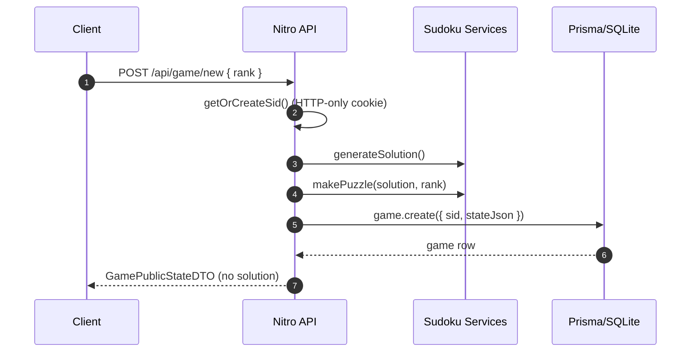
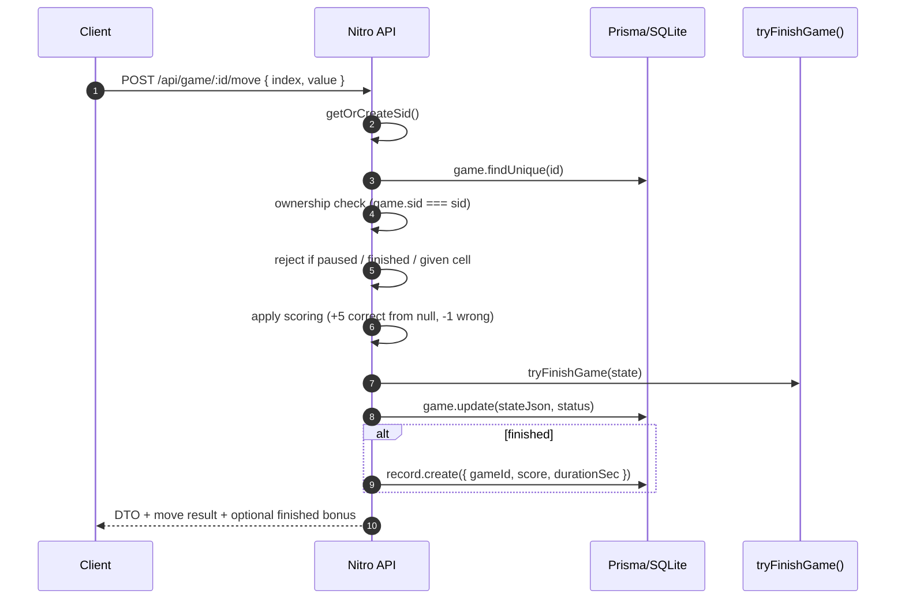

# Backend overview

The backend is implemented using Nitro server routes. Each browser session is
identified by an HTTP-only `sid` cookie; all game operations are scoped to this
session and rejected if the `sid` doesn't match the game owner.

DTOs live in `shared/types/sudoku.ts`, and API handlers live under `server/api/**`.

## API reference

| Method | Path | Body | Response | Notes |
| --- | --- | --- | --- | --- |
| POST | `/api/game/new` | `{ "rank": "beginner" \| "intermediate" \| "hard" \| "expert" }` | `GamePublicStateDTO` | Creates game + sets `sid` cookie. |
| GET | `/api/game/:id` | - | `GamePublicStateDTO` | 403 if `sid` mismatch. |
| POST | `/api/game/:id/move` | `{ "index": 0..80, "value": 1..9 \| null }` | `MoveResponseDTO` | Validates pause/finished/given cell. |
| POST | `/api/game/:id/hint` | - | `HintResponseDTO` | Max 10 hints; fails if no empty cell. |
| POST | `/api/game/:id/pause` | - | `GamePublicStateDTO` | Idempotent. |
| POST | `/api/game/:id/resume` | - | `GamePublicStateDTO` | Idempotent. |
| POST | `/api/game/:id/solve` | - | `SolveResponseDTO` | Dev-only; disabled in production. |
| GET | `/api/games` | - | `{ games: GameSummaryDTO[] }` | Lists current user's games. |
| GET | `/api/records` | - | `{ records: RecordDTO[] }` | Top 3 records by score desc, duration asc. |

## Error behavior

Errors are standard H3 errors with `statusCode` and `statusMessage`:
- `400` for invalid inputs (rank, index, value, paused/finished, no hints).
- `403` when `sid` does not own the game.
- `404` when the game is not found.

# Request flows
#### New Game

##### Puzzle uniqueness
Puzzles are generated by progressively removing cells from a solved grid.
Each removal is validated using a bounded backtracking solver to ensure the
resulting puzzle has **exactly one valid solution**.

This guarantees that all user moves are unambiguous and that the server-side
solution remains the single source of truth.

#### Move

