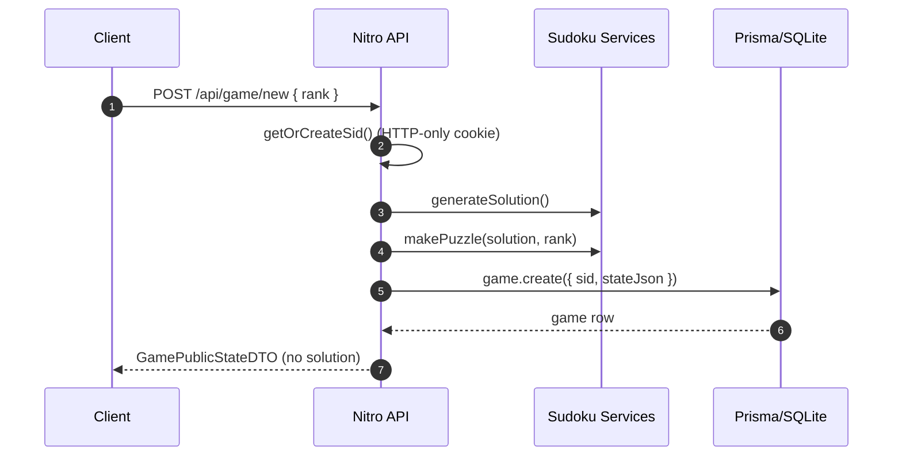
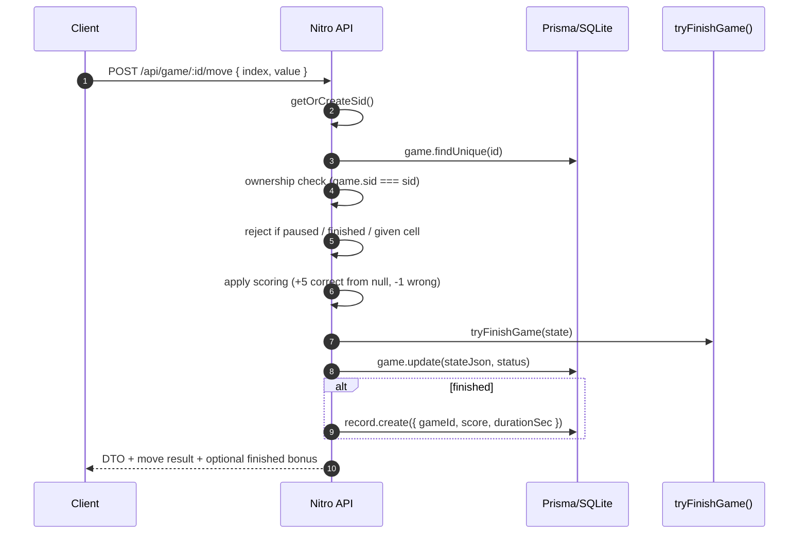

# Request flows
#### New Game

##### Puzzle uniqueness
Puzzles are generated by progressively removing cells from a solved grid.
Each removal is validated using a bounded backtracking solver to ensure the
resulting puzzle has **exactly one valid solution**.

This guarantees that all user moves are unambiguous and that the server-side
solution remains the single source of truth.

#### Move

