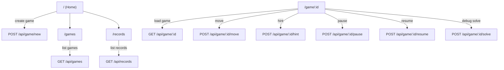
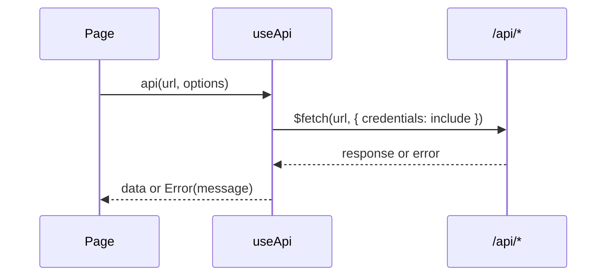

# Frontend Overview

## Pages and API Calls

```mermaid
flowchart TB
  Home["/ (Home)"] -->|create game| NewGame["POST /api/game/new"]
  Home --> Games["/games"]
  Home --> Records["/records"]

  Games -->|list games| ListGames["GET /api/games"]
  Records -->|list records| ListRecords["GET /api/records"]

  GamePage["/game/:id"] -->|load game| GetGame["GET /api/game/:id"]
  GamePage -->|move| Move["POST /api/game/:id/move"]
  GamePage -->|hint| Hint["POST /api/game/:id/hint"]
  GamePage -->|pause| Pause["POST /api/game/:id/pause"]
  GamePage -->|resume| Resume["POST /api/game/:id/resume"]
  GamePage -->|debug solve| Solve["POST /api/game/:id/solve"]
```

## Client Fetch Pattern

```mermaid
sequenceDiagram
  participant Page
  participant useApi
  participant API as /api/*

  Page->>useApi: api(url, options)
  useApi->>API: $fetch(url, { credentials: include })
  API-->>useApi: response or error
  useApi-->>Page: data or Error(message)
```
